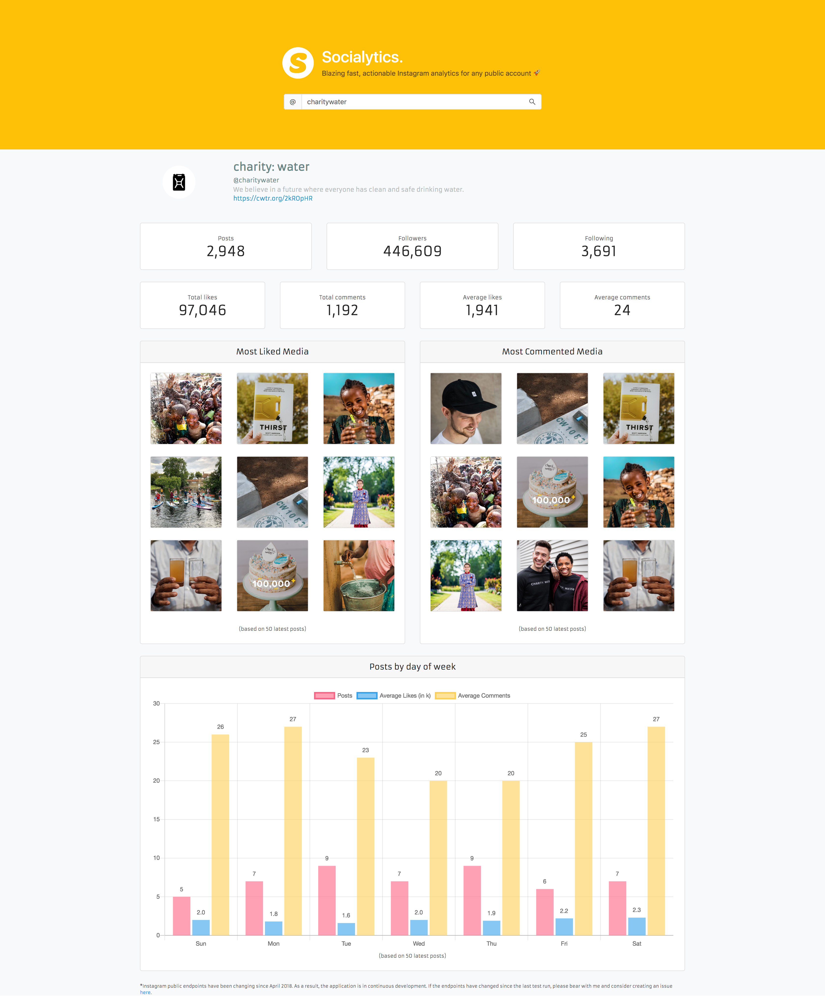

# Socialytics
A web and native desktop app for Instagram analytics. 🚀 Blazing fast insights using Angular 8 and Electron. 

Socialytics provides quick and actionable analytics based on the user's most recent posts. 

Socialytics is the result of its developer's experience of working with social media influencers on a regular basis. When engaging with influencers, the most recent statistics are vital to get an idea of the engagement influencers can drive. All the Instagram analytics services out in the market provide quality analysis but the statistics may be distorted by age old posts and filtering out older posts usually happens at the end of a time consuming number crunching process. Socialytics allows you to make quick decisions based on most recent engagement data.

### Development

1. Clone the repo.
2. Run `npm install`to install the dependencies.
3. Run `ng build && electron .`to build and run the app as an electron app.
    Alternatively, run `ng serve` and navigate to `localhost:4200`.
